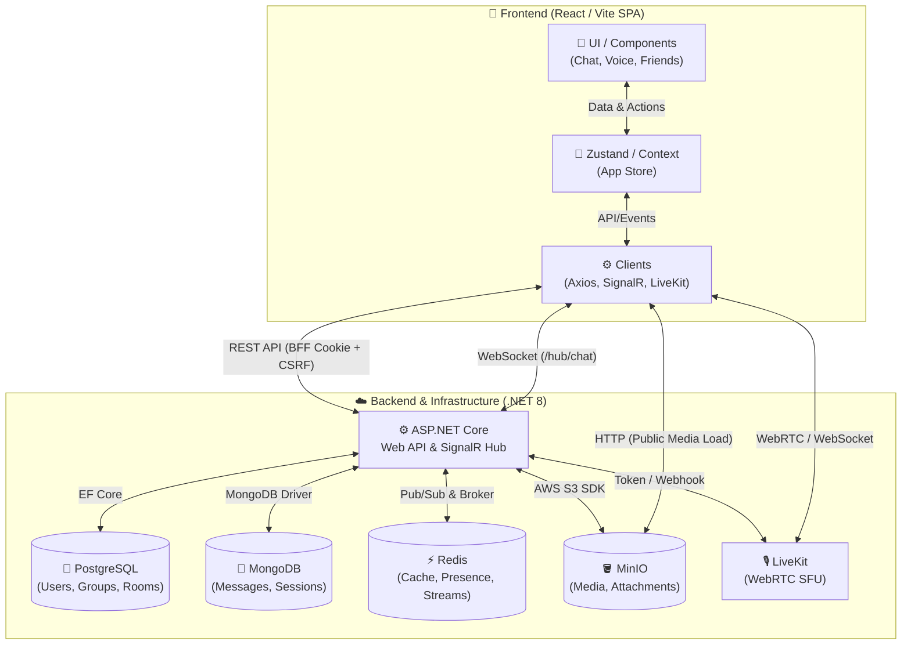

<div align="center">

# 💬 ChatApp

<br>

[](https://react.dev/)
[](https://dotnet.microsoft.com/)
[](https://www.postgresql.org/)
[](https://www.mongodb.com/)
[](https://redis.io/)


</div>

---

## 📑 Mục lục

- [💡 Giới thiệu dự án](#-giới-thiệu-dự-án)
- [🎯 Các vấn đề đã thực hiện](#-các-vấn-đề-đã-thực-hiện) 
- [⚡ Tổng quan nhanh](#-tổng-quan-nhanh)
- [🗺️ Sơ đồ kiến trúc tổng thể](#️-sơ-đồ-kiến-trúc-tổng-thể)
- [✨ Tính năng nổi bật](#-tính-năng-nổi-bật)
- [📂 Cấu trúc thư mục](#-cấu-trúc-thư-mục)
- [🚀 Hướng dẫn cài đặt & Triển khai Local cơ bản](#-hướng-dẫn-cài-đặt--triển-khai-local-cơ-bản)
- [🌍 Hướng dẫn cài đặt & Triển khai Máy chủ cơ bản](#-hướng-dẫn-cài-đặt--triển-khai-máy-chủ-cơ-bản)
- [🤝 Lời ngỏ & Đóng góp](#-lời-ngỏ--đóng-góp)

---

## 💡 Giới thiệu dự án

**MultiRoomChatWebApp** là một ứng dụng chat web thời gian thực được thiết kế theo mô hình nhóm có nhiều phòng. Dự án là một Monorepo Full-stack kết hợp sức mạnh của **React (Vite)** ở phía Frontend và **ASP.NET Core Web API** ở phía Backend.

Dự án không chỉ dừng lại ở các tính năng chat cơ bản mà còn đi sâu vào xử lý kiến trúc hệ thống hiệu năng cao: Quản lý hàng đợi tin nhắn (Message Broker) bằng Redis Streams, triển khai lưu trữ đa mô hình (Hybrid Database với PostgreSQL & MongoDB), xử lý trạng thái hiển thị (Presence), và tích hợp luồng đàm thoại Audio/Video trực tuyến thông qua LiveKit WebRTC. Đồng thời, bảo mật được đặt lên hàng đầu thông qua cơ chế BFF (Backend-For-Frontend) Session kết hợp CSRF Protection.

---

## 🎯 Các vấn đề đã thực hiện

| Hạng mục kỹ thuật | Cách tiếp cận & Xử lý trong dự án |
|-------------------|-----------------------------------|
| ⚡ **Thời gian thực (Real-time)** | Sử dụng SignalR (WebSockets) để thiết lập luồng kết nối 2 chiều. Các sự kiện như: tin nhắn mới, typing indicator, read receipt hay trạng thái online/offline (Presence) được đẩy lập tức đến client. <br>👉 *[Xem đặc tả chi tiết](project-docs/features/realtime.md)* |
| 📬 **Tin nhắn chịu tải cao (Chat Broker)** | Tránh tình trạng nghẽn cổ chai khi ghi trực tiếp dữ liệu vào Database. Dự án áp dụng Redis Streams làm Message Broker giúp tách biệt luồng nhận (Admission), ghi xuống DB (Persistence), phân phối (Delivery) và xử lý lỗi (Dead-letter Queue). <br>👉 *[Xem đặc tả chi tiết](project-docs/features/chat-broker.md)* |
| 🎙️ **Voice & Video Call** | Xây dựng phòng đàm thoại (Voice Channel) và gọi điện trực tiếp (Direct Call) bằng hạ tầng LiveKit (WebRTC SFU). Giúp tách biệt băng thông Media ra khỏi Server Chat chính, xử lý được tính năng Floating Call UI, Screen Sharing và Missed Call. <br>👉 *[Xem đặc tả chi tiết](project-docs/features/voice-call.md)* |
| ☁️ **Lưu trữ Đa mô hình (Hybrid DB)** | Lựa chọn CSDL phù hợp cho từng loại dữ liệu: PostgreSQL xử lý dữ liệu quan hệ chặt chẽ (User, Group, Room, Relationship). MongoDB lưu trữ dữ liệu phi cấu trúc, ghi tốc độ cao (Message, Logs). MinIO (S3) đảm nhiệm lưu trữ Media tĩnh (Avatar, Attachments). <br>👉 *[Xem đặc tả chi tiết](project-docs/architecture/hybrid-database.md)* |
| 🔐 **Bảo mật & Xác thực (BFF)** | Áp dụng kiến trúc Backend-For-Frontend (BFF). Không lưu Access Token tại trình duyệt để tránh XSS. Thay vào đó, ủy quyền bằng HTTP-Only Session Cookie kèm cơ chế Anti-CSRF. Hỗ trợ đa dạng phương thức đăng nhập (Email/Password và Google OAuth). <br>👉 *[Xem đặc tả chi tiết](project-docs/architecture/auth-security.md)* |

---

## ⚡ Tổng quan nhanh

<div align="center">

| Hạng mục | Nền tảng / Công nghệ |
|:---------|:--------|
| 📱 **Nền tảng Frontend** | React 19, TypeScript 5.9, Vite 8, Zustand, React Router 7 |
| 🎨 **Kiến trúc Backend** | Modular Monolith (.NET 8, ASP.NET Core Web API, SignalR) |
| 🐘 **Dữ liệu Quan hệ** | PostgreSQL 16 (Entity Framework Core) |
| 🍃 **Dữ liệu Phi cấu trúc** | MongoDB 7 (Tin nhắn, Lịch sử cuộc gọi) |
| ⚡ **Cache & Message Broker**| Redis 7 & Redis Streams |
| ☁️ **Lưu trữ tệp Media** | MinIO (Tương thích S3 API) |
| 🎙️ **Voice & Video Transport**| LiveKit (WebRTC SFU) |
| 🚀 **Môi trường & Triển khai**| Docker, Docker Compose, Caddy Reverse Proxy |

</div>

---

## 🗺️ Sơ đồ kiến trúc tổng thể



---

## ✨ Tính năng nổi bật

<table>
<tr>
<td width="50%" valign="top">

### 💬 Chat & Thời gian thực
- **Tính năng chat đa dạng:** Hỗ trợ gửi tin nhắn văn bản, đính kèm file media, thả cảm xúc (Reaction), ghim tin nhắn, chỉnh sửa và xóa tin nhắn (Real-time).
- **Trải nghiệm mượt mà:** Hiển thị người đang gõ (Typing Indicator), thông báo tin nhắn đã đọc (Read Receipt) và tải thêm tin nhắn cũ (Infinite Pagination).
- **Phân phối Presence:** Nhận biết trạng thái Online/Offline của người dùng tự động qua bộ đếm Heartbeat của Redis.

</td>
<td width="50%" valign="top">

### 👥 Nhóm, Phòng & Bạn bè
- **Cấu trúc Group -> Room:** Tổ chức theo mô hình phân tầng, một Nhóm có nhiều Phòng (Phòng Chat Text, Phòng Voice, Phòng Kín).
- **Quản lý Thành viên:** Hỗ trợ tính năng mời (Invite Links), cấp quyền quản trị (Owner/Admin/Member), chuyển quyền, kick hoặc xóa nhóm.
- **Quan hệ người dùng (Relationships):** Gửi lời mời kết bạn, danh sách bạn bè, chặn (Block) người dùng và lọc danh sách hiển thị tự động.

</td>
</tr>
<tr>
<td width="50%" valign="top">

### 🎙️ Đàm thoại Voice & Video
- **Phòng thoại (Voice Channel):** Người dùng có thể tham gia/rời phòng thoại bất kỳ lúc nào, hỗ trợ bật/tắt Micro, Camera và Chia sẻ màn hình (Screen Share).
- **Direct Call (DM):** Gọi điện trực tiếp 1-1 với giao diện chuông gọi (Ringing), xử lý trạng thái cuộc gọi nhỡ (Missed Call) và từ chối.
- **Giao diện đa nhiệm:** Hỗ trợ thu nhỏ giao diện cuộc gọi (Floating Call UI) cho phép vừa nói chuyện vừa chuyển hướng nhắn tin phòng khác.

</td>
<td width="50%" valign="top">

### 🛡️ Xác thực & Bảo mật
- **Backend-For-Frontend (BFF):** Loại bỏ hoàn toàn Access Token phía trình duyệt, sử dụng HTTP-Only Cookie kết hợp Anti-CSRF Token cho mọi Request đột biến.
- **Đa phương thức đăng nhập:** Đăng nhập truyền thống (Email/Password) kết hợp luồng xác thực Google OAuth 2.0.
- **Policy phân quyền:** Áp dụng chặt chẽ Resource-based Authorization (Ví dụ: Chỉ thành viên trong phòng mới được xem tin nhắn, chỉ người gửi mới được sửa tin).

</td>
</tr>
</table>

---

## 📂 Cấu trúc thư mục

### ⚙️ Backend (`MultiRoomChatWebApp.Server/`)
```text
MultiRoomChatWebApp.Server/
├── 📁 Modules/               # Kiến trúc Modular Monolith chứa các Domain riêng biệt
│   ├── 📁 Auth/              # Xử lý Đăng nhập, Cookie Session, Google OAuth, CSRF
│   ├── 📁 Chat/              # SignalR Hubs, Redis Streams Broker, Message Logic
│   ├── 📁 Group/             # Logic tạo nhóm, phân quyền, membership
│   ├── 📁 Media/             # Tích hợp MinIO (S3), xử lý Upload Avatar/Attachment
│   ├── 📁 Notification/      # Dịch vụ gửi thông báo
│   ├── 📁 Room/              # Logic quản lý phòng chat (Text/Voice/DM)
│   ├── 📁 User/              # Quản lý Hồ sơ, Bạn bè, Block list, Presence
│   └── 📁 Voice/             # Cấp phát LiveKit Token, xử lý webhook sự kiện gọi
├── 📁 Infrastructure/        # Tầng hạ tầng: EF Core DbContext, Migrations
├── 📁 Shared/                # Shared Kernel: Middleware, Custom Exceptions, Utils
├── 📄 Program.cs             # Khởi tạo DI, Cấu hình Pipeline & Middleware
└── 📄 Dockerfile             # Script build Production cho Backend + Serve Frontend
```

### 📱 Frontend (`multiroomchatwebapp.client/`)
```text
multiroomchatwebapp.client/
├── 📁 src/
│   ├── 📁 api/               # Cấu hình Axios instance & API hooks (REST)
│   ├── 📁 components/        # UI Components chia nhỏ (Modals, Buttons, Layouts...)
│   ├── 📁 context/           # React Context (SignalRProvider, LiveKitProvider...)
│   ├── 📁 hooks/             # Custom React Hooks xử lý logic tái sử dụng
│   ├── 📁 pages/             # Các trang hiển thị chính (Login, MainChatLayout...)
│   ├── 📁 services/          # Các lớp xử lý giao tiếp phi giao diện
│   ├── 📁 store/             # Zustand global state (ChatStore, UserStore...)
│   └── 📁 types/             # TypeScript interfaces định nghĩa kiểu dữ liệu DTO
└── 📄 package.json           # Cấu hình thư viện và script Vite Build
```

---

## 🚀 Hướng dẫn cài đặt & Triển khai Local cơ bản

### Yêu cầu hệ thống
- **.NET SDK 8.0**
- **Node.js 22 & npm**
- **Docker & Docker Compose** (Để chạy hạ tầng Database/Redis/MinIO)

### Bước 1: Khởi chạy Hạ tầng Dịch vụ (Infrastructure)
Để chạy dự án, cần các dịch vụ cơ bản. Bạn có thể sử dụng file cấu hình Compose (nếu tự tạo local) hoặc chạy container thủ công:
- **PostgreSQL**: Cổng `5432` (hoặc `5433`)
- **MongoDB**: Cổng `27017` (hoặc `27018`)
- **Redis (Cache & Presence)**: Cổng `6379`
- **Redis (Chat Broker)**: Cổng `6380` (Nên tách riêng instance)
- **MinIO**: Cổng `9000` (API), `9001` (Console)
- **LiveKit Server**: Cổng `7880`, `7881`, `UDP 50000-50100`

### Bước 2: Cấu hình Backend
1. Tạo tệp `MultiRoomChatWebApp.Server/appsettings.Development.json` dựa trên mẫu. Cập nhật Connection Strings trỏ đúng vào các dịch vụ vừa dựng ở Bước 1.
2. Khởi tạo Database Migration (nếu chưa có):
   ```bash
   dotnet tool install --global dotnet-ef
   dotnet ef database update --project MultiRoomChatWebApp.Server
   ```
3. Chạy Backend Server:
   ```bash
   dotnet run --project MultiRoomChatWebApp.Server
   ```
   > Backend sẽ chạy tại `https://localhost:7222`, giao diện Swagger: `https://localhost:7222/swagger`

### Bước 3: Cấu hình & Khởi chạy Frontend
1. Mở Terminal mới, di chuyển vào thư mục Frontend:
   ```bash
   cd multiroomchatwebapp.client
   npm ci
   ```
2. Khởi chạy Vite Dev Server:
   ```bash
   npm run dev
   ```
   > Frontend chạy tại `https://localhost:5173`. Các luồng API (`/api/*`) và SignalR (`/hub/*`) sẽ tự động được Proxy về Backend.

---

## 🌍 Hướng dẫn cài đặt & Triển khai Máy chủ cơ bản

Chi tiết về kiến trúc, bảo mật và quy trình đưa dự án lên máy chủ thật được trình bày tại:
👉 **[Tài liệu Triển khai Server](project-docs/deploy/deploy.md)**

---

## 🤝 Lời ngỏ & Đóng góp

Dự án được xây dựng với mục tiêu cung cấp một kiến trúc hệ thống Chat toàn diện, tuân thủ các nguyên tắc thiết kế Module hóa và sử dụng hệ sinh thái công nghệ đa dạng để giải quyết chính xác từng bài toán đặc thù.

Mọi quyết định về mặt kiến trúc, giải pháp công nghệ cũng như luồng xử lý nghiệp vụ trong dự án này đều mang góc nhìn cá nhân của tôi, do đó chắc chắn không thể tránh khỏi những thiếu sót. 
Nếu bạn phát hiện lỗi (bug) hoặc có ý tưởng cải tiến kiến trúc/tính năng, vui lòng mở **Issue** hoặc tạo **Pull Request**. Mọi đóng góp của bạn đều rất được hoan nghênh và trân trọng!
