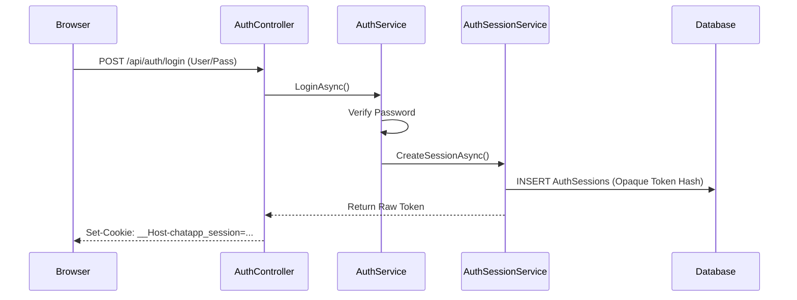
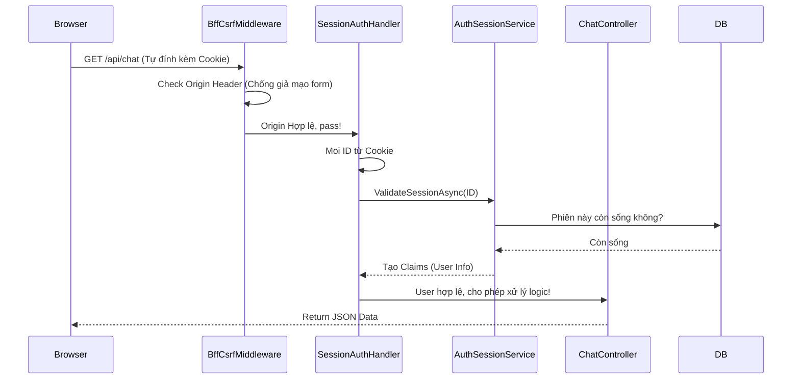

# Kiến trúc Bảo mật & Xác thực (BFF Authentication)

Tài liệu này cung cấp bức tranh toàn cảnh về Module Auth, giúp các thành viên mới nắm được triết lý thiết kế và luồng đi của dữ liệu mà không cần phải nhảy qua lại giữa hàng chục file code C#.

## 1. Tại sao lại phức tạp như vậy? (Triết lý thiết kế)

Dự án này **KHÔNG sử dụng JWT tĩnh** (JSON Web Tokens) trả thẳng về Frontend như các dự án SPA thông thường. Việc ném JWT cho Frontend lưu ở `localStorage` tiềm ẩn rủi ro cực lớn về bảo mật (bị XSS đánh cắp token).

Thay vào đó, dự án sử dụng kiến trúc **BFF (Backend-For-Frontend) Opaque Session**:
- Backend không trả JWT cho Frontend. Nó chỉ trả về một chuỗi ngẫu nhiên vô nghĩa (Opaque Token).
- Chuỗi ngẫu nhiên này được Backend "nhét" thẳng vào một **Cookie siêu bảo mật** (`HttpOnly`, cờ `__Host-`) gửi về trình duyệt.
- Frontend (JavaScript) **hoàn toàn mù tịt** về Cookie này, không thể đọc, không thể sửa. Trình duyệt sẽ tự động đính kèm Cookie này vào mọi request gửi lên Backend.

Để mô hình này hoạt động, Module Auth cần một cơ chế phức tạp hơn nhiều để vừa dịch Cookie thành Session, vừa phải chặn đứng các lỗ hổng giả mạo (CSRF).

## 2. Bản đồ Thư mục (Cấu trúc Module)

Module Auth được chia làm 3 ranh giới trách nhiệm rõ ràng:

```text
Modules/Auth/
├── Authentication/      # Tầng HTTP & Security (Gác cổng)
│   ├── BffCsrfProtectionMiddleware.cs    (Chặn request giả mạo Origin)
│   ├── BffSessionAuthenticationHandler.cs(Móc Cookie, check DB)
│   └── BffSessionCookie.cs               (Cấu hình Cookie an toàn)
│
├── Services/            # Tầng Business Logic (Xử lý nghiệp vụ)
│   ├── AuthService.cs                    (Check User/Pass, Register)
│   ├── AuthSessionService.cs             (Quản lý vòng đời Session trong DB)
│   └── AuthSessionCleanupWorker.cs       (Lao công dọn rác Session hết hạn)
│
├── Core/                # Tầng Models & Hợp đồng (Khung xương)
│   ├── Entities/AuthSession.cs           (Bảng lưu Session)
│   ├── Interfaces/                       (Giao tiếp lỏng lẻo)
│   └── DTOs/ & Validators/               (Data Transfer)
```

## 3. Các Luồng Vận Hành Cốt Lõi (Workflows)

### Luồng 1: Đăng nhập (Login)



### Luồng 2: Xác thực API thông thường (Mọi API)

Khi user gọi bất kỳ API nào cần quyền đăng nhập (VD: Lấy danh sách phòng chat):



## 4. Tóm lược vòng đời Session (Lao công dọn rác)

Vì mọi phiên đăng nhập đều được lưu trong Database, hệ thống cần cơ chế tự dọn dẹp để DB không bị phình to:
- **`AuthSessionCleanupWorker`**: Chạy ngầm 24/7 (BackgroundService).
- Cứ mỗi khoảng thời gian (vd: 1 tiếng), worker này sẽ thức dậy, quét DB và xóa vĩnh viễn các dòng `AuthSessions` có cờ `RevokedAt` (đã đăng xuất) hoặc thời gian `ExpiresAt` nằm trong quá khứ.
